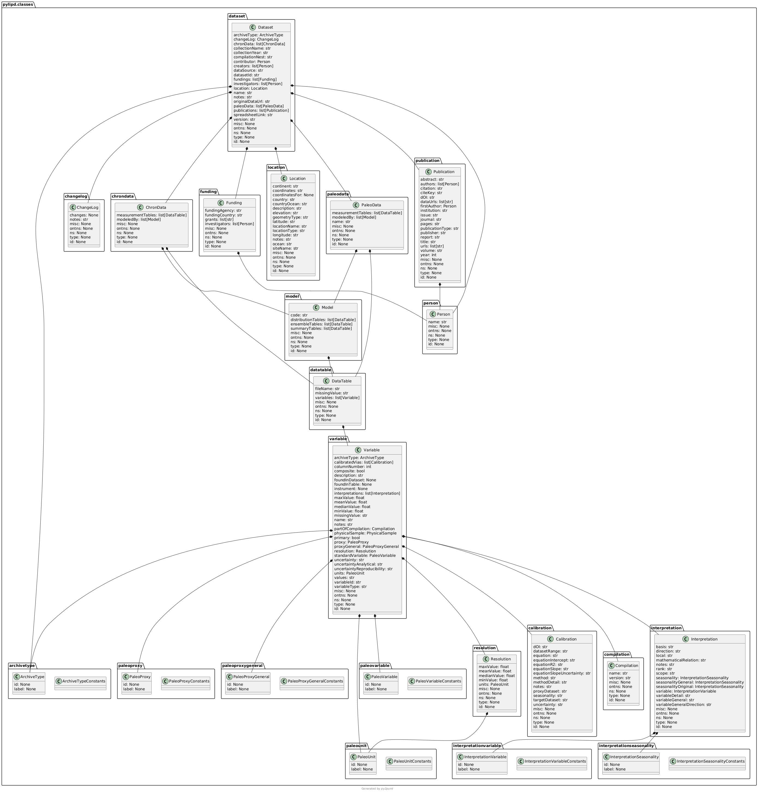

.. _api:

PyLiPD User API
===============

The following describes the main classes that makes up PyLiPD. Most users will only interface with the functionalies contained in these classes. 

LiPD (pylipd.lipd.LiPD)
""""""""""""""""""

.. autoclass:: pylipd.lipd.LiPD
   :members:

LiPDSeries (pylipd.lipd_series.LiPDSeries)
""""""""""""""""""

.. autoclass:: pylipd.lipd_series.LiPDSeries
   :members:

LiPD Classes 
"""""""""""""

These classes and associated methods are directly derived from the `LinkedEarth Ontology <http://linked.earth/ontology/>`_. See the diagram below to understand how the objects are related to each other and what type of objects/strings the various functions will return.

.. autoclass:: pylipd.classes.dataset.Dataset
   :members:
   :undoc-members:

.. autoclass:: pylipd.classes.paleodata.PaleoData
   :members:
   :undoc-members:

.. autoclass:: pylipd.classes.chrondata.ChronData
   :members:
   :undoc-members:

.. autoclass:: pylipd.classes.datatable.DataTable
   :members:
   :undoc-members:

.. autoclass:: pylipd.classes.variable.Variable
   :members:
   :undoc-members:

.. autoclass:: pylipd.classes.calibration.Calibration
   :members:
   :undoc-members:

.. autoclass:: pylipd.classes.uncertainty.Uncertainty
   :members:
   :undoc-members:

.. autoclass:: pylipd.classes.interpretation.Interpretation
   :members:
   :undoc-members:

.. autoclass:: pylipd.classes.changelog.ChangeLog
   :members:
   :undoc-members:

.. autoclass:: pylipd.classes.funding.Funding
   :members:
   :undoc-members:

.. autoclass:: pylipd.classes.location.Location
   :members:
   :undoc-members:

.. autoclass:: pylipd.classes.model.Model
   :members:
   :undoc-members:

.. autoclass:: pylipd.classes.publication.Publication
   :members:
   :undoc-members:

.. autoclass:: pylipd.classes.resolution.Resolution
   :members:
   :undoc-members:

.. autoclass:: pylipd.classes.physicalsample.PhysicalSample
   :members:
   :undoc-members:

.. autoclass:: pylipd.classes.publication.Person
   :members:
   :undoc-members:

LiPD Controlled Vocabulary 
"""""""""""""""""""""""""""
.. autoclass:: pylipd.classes.archivetype.ArchiveType
   :members:
   :undoc-members:

.. autoclass:: pylipd.classes.archivetype.ArchiveTypeConstants
   :members:
   :undoc-members:

.. autoclass:: pylipd.classes.archivetype.PaleoUnit
   :members:
   :undoc-members:

.. autoclass:: pylipd.classes.paleounit.PaleoUnitConstants
   :members:
   :undoc-members:

.. autoclass:: pylipd.classes.paleoproxy.PaleoProxy
   :members:
   :undoc-members:

.. autoclass:: pylipd.classes.paleoproxy.PaleoProxyConstants
   :members:
   :undoc-members:

.. autoclass:: pylipd.classes.paleoproxygeneral.PaleoProxyGeneral
   :members:
   :undoc-members:

.. autoclass:: pylipd.classes.paleoproxygeneral.PaleoProxyGeneralConstants
   :members:
   :undoc-members:

.. autoclass:: pylipd.classes.paleovariable.PaleoVariable
   :members:
   :undoc-members:

.. autoclass:: pylipd.classes.paleovariable.PaleoVariableConstants
   :members:
   :undoc-members:

.. autoclass:: pylipd.classes.interpretationvariable.InterpretationVariable
   :members:
   :undoc-members:

.. autoclass:: pylipd.classes.interpretationvariable.InterpretationVariableConstants
   :members:
   :undoc-members:

.. autoclass:: pylipd.classes.interpretationseasonality.InterpretationSeasonality
   :members:
   :undoc-members:

.. autoclass:: pylipd.classes.interpretationseasonality.InterpretationSeasonalityConstants
   :members:
   :undoc-members: