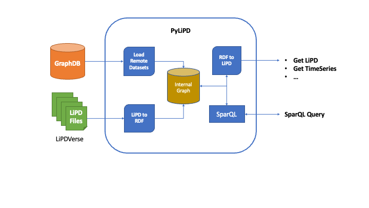

.. PyLiPD documentation master file, created by
   sphinx-quickstart on Fri Feb 10 15:48:28 2023.
   You can adapt this file completely to your liking, but it should at least
   contain the root `toctree` directive.

Introduction
============

PyLiPD is a Python package for handling `LiPD <http://lipd.net>`_ datasets. 

PyLiPD loads the Linked Paleo Data (`LiPD <http://lipd.net>`_), either locally or online, and converts them internally into `RDF graphs <https://en.wikipedia.org/wiki/Resource_Description_Framework#:~:text=RDF%20is%20a%20directed%20graph,be%20identified%20by%20a%20URI.>`_ for further querying. Alternatively, PyLiPD can also read an RDF Knowledge Base like GraphDB directly that is populated by the LiPD datasets converted into RDF graphs. In short, it allows you to work seamlessly with LiPD files stored on your computer, on the web or in a dedicated database meant to work with graphs.

PyLiPD can use the internal/remote graph representation to either answer `SparQL <https://www.ontotext.com/knowledgehub/fundamentals/what-is-sparql/>`_  queries about the datasets, or simply convert it back to LiPD, or get the TimeSeries objects across multiple datasets for further analysis by packages such as `Pyleoclim <https://pyleoclim-util.readthedocs.io/en/latest/>`_ or `CFR <https://fzhu2e.github.io/cfr/>`_.

The package makes working with the Graph representation easier. You do no need to learn SparQL to start working with PyLiPD. However, SparQL is a fast, efficient language that makes querying much easier so we won't stop you from learning it. 

In summary, PyLiPD allows you to:
* Open LiPD-formatted datasets stored locally on your computer, available through a URL or our Graph Database, the `LiPDGraph <https://linkedearth.graphdb.mint.isi.edu>`_. 
* Manipulate these datasets to query information either through Pandas, SPARQL-supported APIs or SPARQL queries
* Create LiPD files

Getting Started
===============

.. toctree::
   :maxdepth: 1
   :caption: Working with PyLiPD

   installation.rst
   api.rst
   tutorials.rst

Getting Involved
================

.. toctree::
   :Hidden:
   :caption: Getting Involved
   :maxdepth: 1

   citation.rst
   contribution_guide.rst

PyLiPD has been made freely available under the terms of the `Apache License 2.0 <https://github.com/LinkedEarth/pylipd/blob/main/LICENSE>`_ and follows an open development model. There are many ways to get :ref:`involved in the development of PyLiPD <contributing_to_pylipd>`:

* If you write a paper making use of Pyleoclim, please cite it :ref:`thus <citing_pylipd>`.
* Report bugs and problems with the code or documentation to our `GitHub repository <https://github.com/LinkedEarth/PyLiPD/issues>`_. Please make sure that there is not outstanding issues that cover the problem you're experiencing.
* Contribute bug fixes
* Contribute enhancements and new features
* Contribute to the code documentation, and share your PyLiPD-supported scientific workflow as a (`PaleoBook <http://linked.earth/PaleoBooks/>`_).

Indices and tables
==================

* :ref:`genindex`
* :ref:`modindex`
* :ref:`search`
